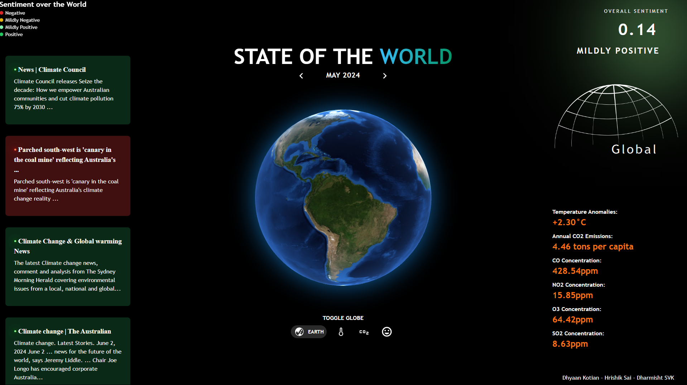
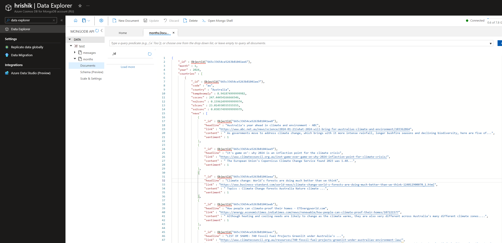
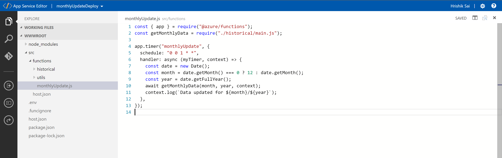
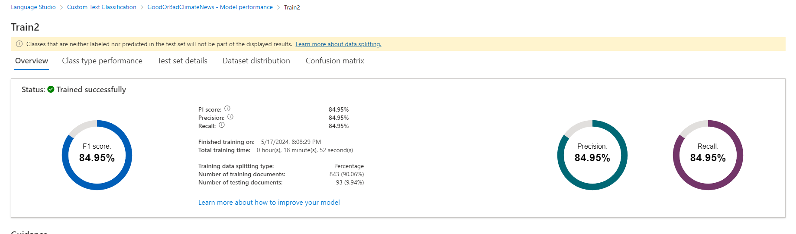
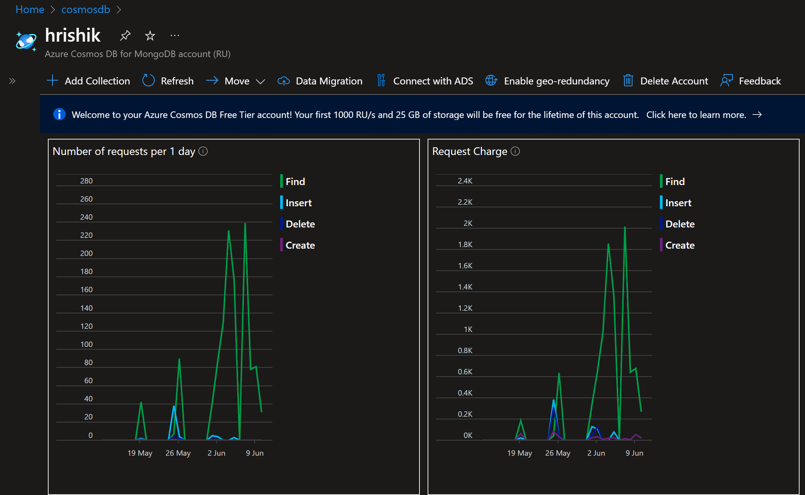
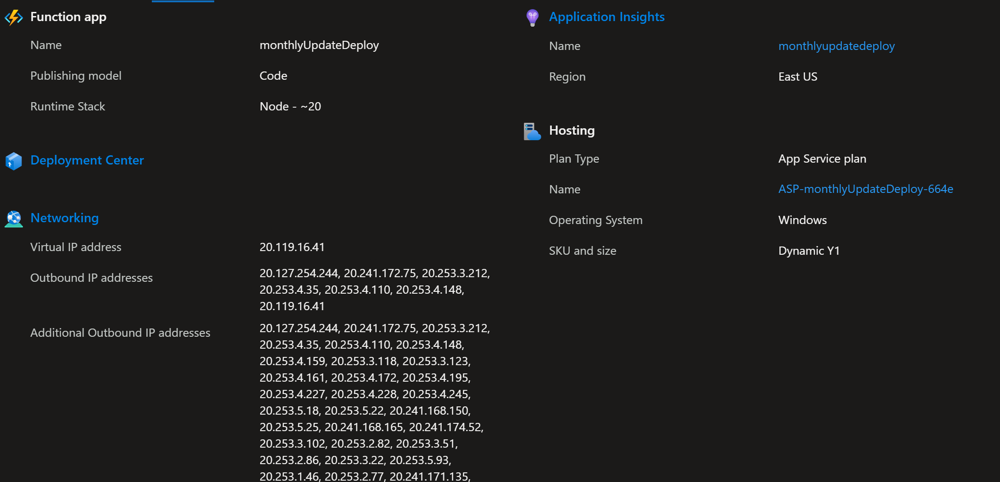
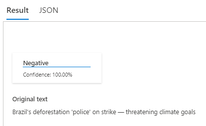
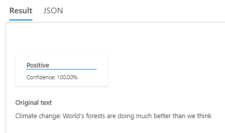

<h1 align="center"> State of the World <a href="https://stateoftheworld.vercel.app">[Live Link]</a> | <a href="https://drive.google.com/file/d/1O7H_h5-T2hSbDf5F3ZfJA5Sk2455sEJB/view?usp=sharing">[Demo Video]</a></h1>
<p align="center">
    
</p>
<h3 align = "center"> A one stop website to track the fight against climate change. </h3>
<p>
    
</p>

## Contents

  <ol>
    <li><a href="#about-the-project">About The Project</a></li>
    <li><a href="#overview">Overview</a></li>
    <li><a href="#services">Azure Services Used</a></li>
    <li><a href="#project-structure">Project Structure</a></li>
    <li><a href="#features">Features</a></li>
    <li><a href="#installation">Installation and Usage</a></li>
    <li><a href="#credits">Credits</a></li>
  </ol>

<p>
    
</p>

<h2 id = "about-the-project"> About the Project</h2>
State of the World is a Azure + MERN App that visualizes climate change through country specific temperature anomalies, CO2 emissions, pollutant concentrations as well as news headlines for the top 15 global economies on a monthly basis.

<h2 id="overview">Overview</h2>
The project aims to fetch and display a number of climate change indicators for each country which includes annual CO2 emmissions of a country, as well as monthly average emissions of CO, NO2, SO2, and O3.
<br><br>
Additionally, the project displays the 10 most relevant climate change news articles per country on a monthly basis, classified into good or bad news via a custom-trained text-classification model.
<br><br>
The collected data is visualized on multiple 3D globes rendered on the website.
<br><br>
The colors on each component (either red, green or yellow) reflect the general conditions of each parameter.
<br><br>
<p>
    
</p>

<h2 id="services">Azure Services Used</h2>

### Core Azure Services

#### _I. Azure CosmosDB_

As the project requires to draw data on monthly news headlines and climate statistics of various countries, we chose _Azure CosmosDB for MongoDB_ to store this data in a NoSQL format in the cloud.

This data is queried by month every time a user requests it through the front end.


<p align="center"><em>A screenshot of the CosmosDB data explorer, showing a sample document</em></p>

We chose CosmosDB for MongoDB as we wanted real time fetching of data in a specific format(JSON) only.

#### _II. Azure Functions_

To update the database with the complete statistics and headlines of the prior month, we leveraged the event driven nature of _Azure functions_, particularly the timer trigger.

We configured the data fetch functions to trigger on the 1st of every new month.


<p align="center"><em>The main file of the Azure functions project, with the CRON timer trigger.</em></p>

### Azure AI Service

#### _Azure AI Language Service_

To estimate the overall sentiment of the monthly news headlines mined for each country, we utilised _Custom Text Classification_ of the Azure AI Language Suite. This involved manually labelling 930+ headlines as "Good News" or "Bad News", and training a custom text multilingual classification model on this dataset through the Language Studio UI.

The model achieved an F1 score of 84.95%.


<p align="center"><em>Performance of the model upon testing</em></p>

We used the Azure Language REST API to programmatically classify headlines that were mined on the fly before storing it in the database.

### Other Azure Technologies

#### Azure App Service

We deployed the backend server on Azure Web Apps from Node.js. Our backend server consisted of two custom API endpoints that we created for querying the [months data](https://sotwserver.azurewebsites.net/months/1/2024) from the database, as well as fetching [annual CO2 emissions](https://sotwserver.azurewebsites.net/co2) of countries.

These API endpoints are live at `https://sotwserver.azurewebsites.net/months/{month}/{year}`, and `https://sotwserver.azurewebsites.net/co2` respectively.

_Note: The month data was only mined for the year 2024._

<h2 id="project-structure">Project Structure</h2>

The project is divided into three main directories:

- `backend/`: Contains the server-side code, including API routes, as well as Azure Functions.
- `frontend/`: Contains the client-side code, including React components, assets and utility functions.
- `shared/`: Contains shared resources, such as JSON data as well as common utils shared between the server and azure functions. These are `npm install`'d on their respective directories.

The tech stack for the project includes:

- **MongoDB** as the database hosted through **Azure CosmosDB**
  **Node** and **Express** server backend deployed to **Azure Web Apps**.
- Serverless **Azure Functions** that are triggered every month for updating the database.
- **React** on the front end using **Three.js** for 3D rendering and **Tailwind** for styling, served deployed through **Vercel**.
  <!-- <p>
      
  </p> -->
  <!-- <p>
      
  </p> -->
  <h2 id="features">Features</h2>

1. Monthly temparature anomalies of countries are calculated from data obtained from the OpenWeatherMap [historical](https://openweathermap.org/history) and [accumulated parameters](https://openweathermap.org/api/accumulated-parameters) API.
1. Monthly average of CO, NO2, SO2 and O3 emissions of countries are calculated from the OpenWeather [air pollution](https://openweathermap.org/api/air-pollution) API.
1. Climate change news for each month is fetched via scraping advanced Google search results.
1. Classification of news headline done by a custom trained text classification Machine Learning algorithm implemented in the Azure AI Language Studio.
<p>
    
</p>
<p>
    
</p>

5. This data is displayed intuitively on multiple globes we have devised for this project.
1. The data is updated automatically every month.
1. Additionally, the serverside code caches data received from the database for an hour, to prevent unnecessary database queries.
1. On the client side, the browser is set to cache data received for 12 hours.
 
<p>
    
</p>

<h2 id="installation">Installation and Usage</h2>

The website can be accessed at http://stateoftheworld.vercel.app/ <br>
The data can be accessed at https://sotwserver.azurewebsites.net/months/ ... followed by the required month and year

You can also build the website from source locally:

1. Clone the repository.
2. Install the dependencies in the root directory, frontend, and backend:

```sh
npm install
cd frontend && npm install
cd ../backend && npm install
```

To start the frontend development server:

```sh
cd frontend && npm run dev
```

To start the backend server:

```sh
cd backend && node index.js
```

<h2 id="credits">Credits</h2>

"State of the World" was ideated, designed and developed by

### Dharmisht SVK [[dragn0id](https://github.com/dragn0id)]

- Tested the project throughout every stage of development
- Prepared Codebase for hosting
- Hosted Node.js server on Azure App Services
- Deployed the web app to Vercel

### Dhyaan Kotian[[Dhyaan1](https://github.com/Dhyaan1)]

- Developed the Website frontend UI and responsive design
- Developed the Website functionality to work smoothly with data fetched from Azure CosmoDB
- Trained and deployed the Azure Language AI custom classification model and created the API endpoints for it

### Hrishik Sai [[fringewidth](https://github.com/fringewidth)]

- Developed the main backend functionality, including data fetching through Azure functions, custom API endpoints, and the CosmosDB.
- Implemented all globes using Three.js
- Designed the Website UI
